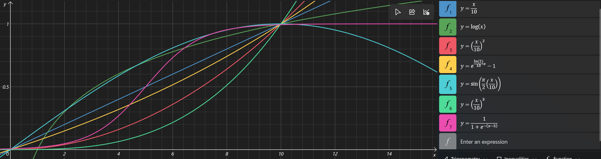
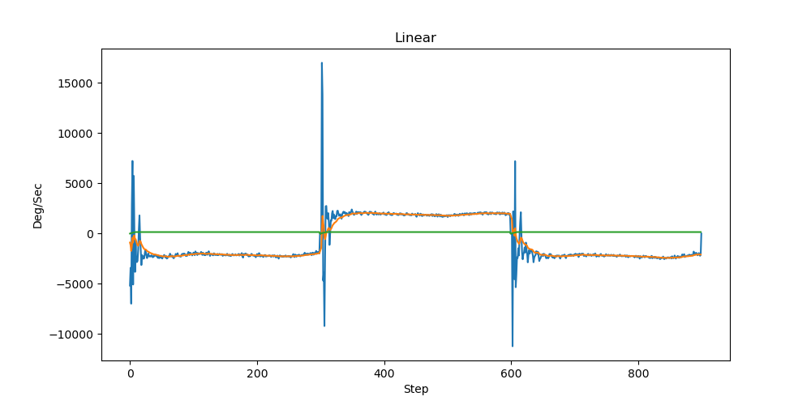
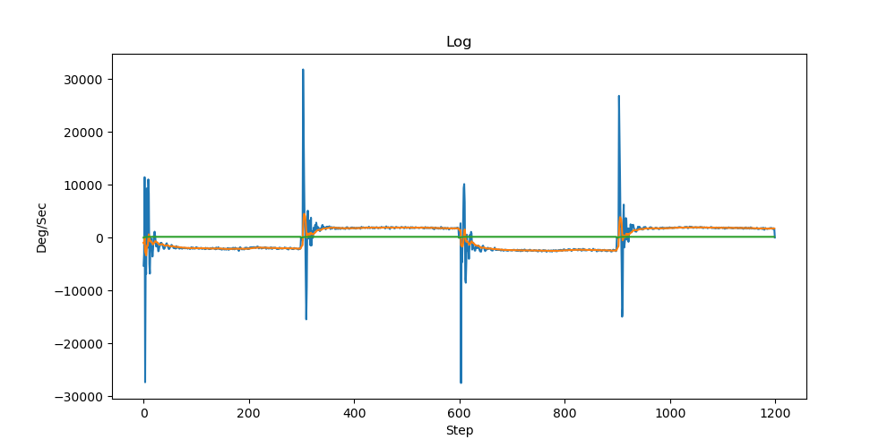
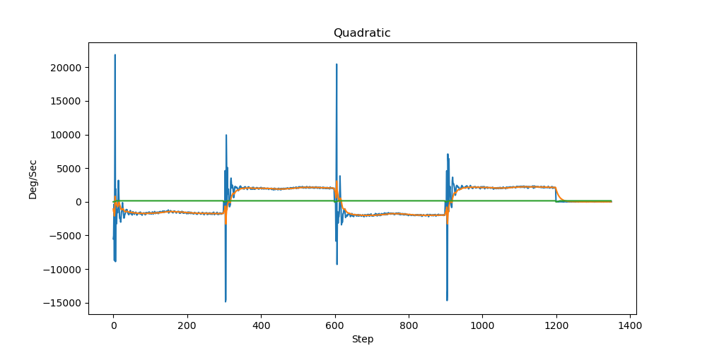
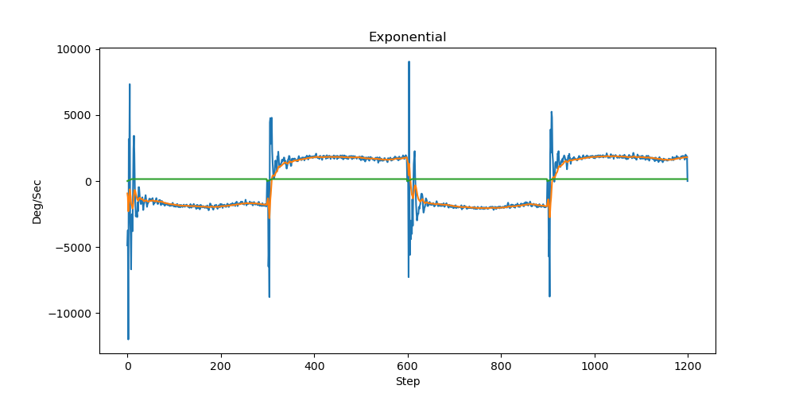
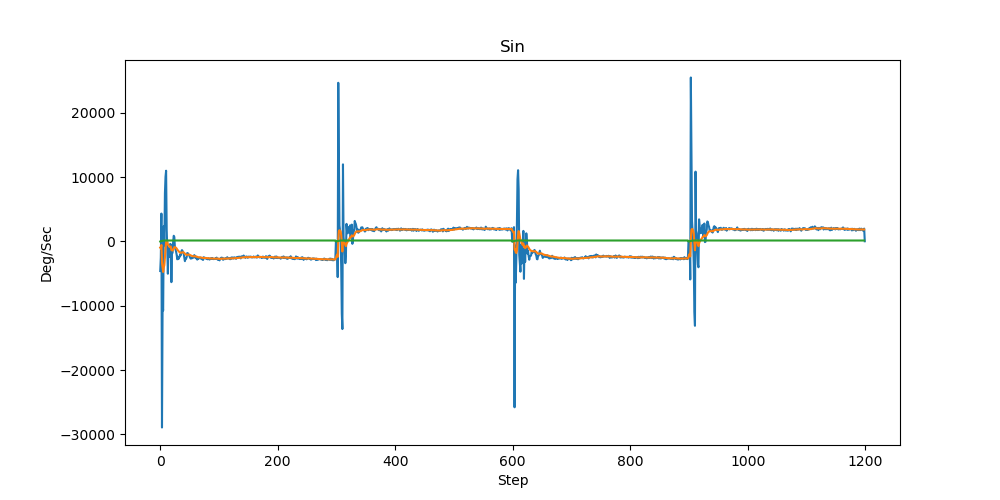
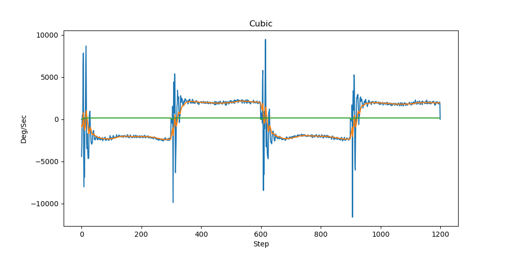
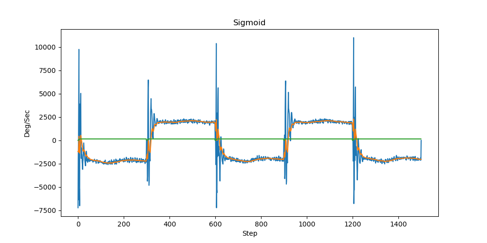

# SpeedProfile

Measuring the Kinematics parameters of an Inverted Pendulum with different speed profiles. 

### Project Description: Comparing Speed Profiles and Gyro Effects on Stepper Motor Movement

In this project, we investigate the impact of 7 different speed profiles on the movement of a stepper motor, utilizing the gyroscopic effect for enhanced control. The goal is to determine which speed profile offers the most efficient and smooth operation of the stepper motor in various scenarios. 

#### Gyroscopic Data Handling
To account for the gyroscopic effect, the rotation data is obtained from the accelerometer and gyroscope sensor using the following code:

```cpp
accelgyro.getRotation(&gx, &gy, &gz);
gy = gy - 135; // Offset
gyFiltered = alpha * gy + (1 - alpha) * gyFiltered;
```

Here, the gyroscopic data (`gy`) is adjusted with an offset of 135 units to correct for sensor bias. The filtered gyroscopic data (`gyFiltered`) is then calculated using a low-pass filter with a smoothing factor `alpha`.

#### Speed Profile Implementations
Various speed profiles were implemented to modulate the delay between steps of the stepper motor, which in turn affects its speed. The profiles explored include:


1. **Linear:**
   ```cpp
   new_delay = delayMicros / (step / set_step);
   ```


2. **Logarithmic:**
   ```cpp
   new_delay = delayMicros / (log(step) / log(set_step));
   ```


3. **Quadratic:**
   ```cpp
   new_delay = delayMicros / (pow(step, 2) / pow(set_step, 2));
   ```


4. **Exponential:**
   ```cpp
   new_delay = delayMicros / (pow(e, step * ln2 / set_step) - 1);
   ```


5. **Sine:**
   ```cpp
   new_delay = delayMicros / sin(1.571 * step / set_step);
   ```

6. **Cubic:**
   ```cpp
   new_delay = delayMicros / (pow(step, 3) / pow(set_step, 3));
   ```


7. **Sigmoid:**
   ```cpp
   new_delay = delayMicros / (1 / (1 + pow(e, -(step - (set_step / 2)))));
   ```

Each profile alters the `new_delay` variable, which is used to control the time interval between motor steps. This directly influences the motor's speed and smoothness of operation.

#### Speed Calculation
The rotational speed of the stepper motor (in RPM) is calculated using the delay between steps:

```cpp
speed = 60 / (200 * new_delay * pow(10, -6));
```

This formula converts the delay into RPM, providing a standard metric for comparing the performance of different speed profiles.

### Conclusion
By comparing these various speed profiles, we aim to identify the most effective method for controlling the stepper motor, balancing speed and smoothness. This project demonstrates the importance of selecting appropriate speed profiles for applications requiring precise motor control, and highlights the role of gyroscopic feedback in achieving optimal performance.
